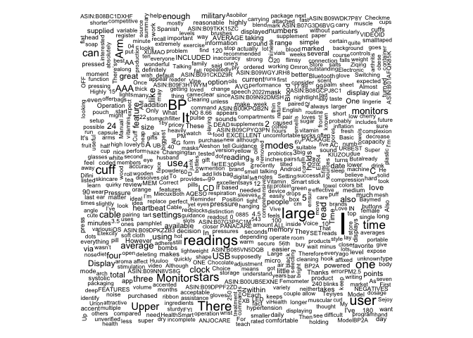
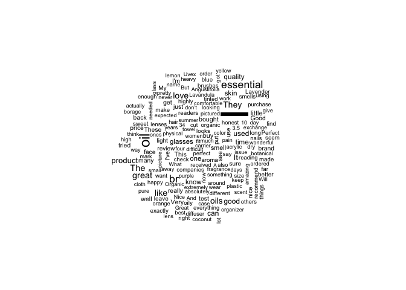

Laboratorio#7
================
Isaac Cyrman
2024-10-20

# Librerias y carga de datos

``` r
suppressPackageStartupMessages({
  library(readr)       
  library(dplyr)     
  library(tm)       
  library(wordcloud)  
  library(RColorBrewer) 
})
```

    ## Warning: package 'tm' was built under R version 4.3.3

    ## Warning: package 'NLP' was built under R version 4.3.3

``` r
Health_and_Personal_Care_metadata <- read_csv("Health_and_Personal_Care_metadata.csv")
```

    ## Rows: 60293 Columns: 8
    ## ── Column specification ────────────────────────────────────────────────────────
    ## Delimiter: ","
    ## chr (5): main_category, title, store, details, parent_id
    ## dbl (3): average_rating, rating_number, price
    ## 
    ## ℹ Use `spec()` to retrieve the full column specification for this data.
    ## ℹ Specify the column types or set `show_col_types = FALSE` to quiet this message.

``` r
View(Health_and_Personal_Care_metadata)

Health_and_Personal_Care <- read_csv("Health_and_Personal_Care.csv")
```

    ## Rows: 494121 Columns: 8
    ## ── Column specification ────────────────────────────────────────────────────────
    ## Delimiter: ","
    ## chr (5): title, text, product_id, parent_id, user_id
    ## dbl (2): rating, timestamp
    ## lgl (1): verified_purchase
    ## 
    ## ℹ Use `spec()` to retrieve the full column specification for this data.
    ## ℹ Specify the column types or set `show_col_types = FALSE` to quiet this message.

``` r
View(Health_and_Personal_Care)
```

# 1) Cuántos productos contienen reviews con las palabras “love”, “recommend” y “enjoy”?

Este análisis filtra las reseñas que contienen las tres palabras clave y
cuenta cuántos productos únicos tienen dichas reseñas.

``` r
# Filtrar las reseñas que contienen todas las palabras clave: "love", "recommend" y "enjoy"
filtered_reviews <- Health_and_Personal_Care %>%
  filter(
    grepl("love", text, ignore.case = TRUE) &
    grepl("recommend", text, ignore.case = TRUE) &
    grepl("enjoy", text, ignore.case = TRUE)
  )

# Contar el número de productos únicos que cumplen con el criterio
unique_products <- filtered_reviews %>%
  distinct(product_id) %>%
  count() %>%
  pull(n)

# Mostrar el resultado
cat("Número de productos con reseñas que contienen 'love', 'recommend' y 'enjoy':", unique_products, "\n")
```

    ## Número de productos con reseñas que contienen 'love', 'recommend' y 'enjoy': 110

# 2) De los reviews de la pregunta 1, encuentre el top 5 de las tiendas que los venden?

Aquí identificamos las cinco tiendas que tienen la mayor cantidad de
reseñas filtradas en el paso anterior.

``` r
# Unir las reseñas filtradas con los metadatos para obtener información de la tienda
merged_data <- filtered_reviews %>%
  inner_join(Health_and_Personal_Care_metadata, by = c("product_id" = "parent_id"))

# Contar el número de reseñas por tienda
store_counts <- merged_data %>%
  group_by(store) %>%
  summarise(review_count = n()) %>%
  arrange(desc(review_count))

# Obtener las 5 tiendas con más reseñas
top_5_stores <- store_counts %>%
  slice_max(order_by = review_count, n = 5)

# Mostrar el resultado
cat("Top 5 tiendas con más reseñas filtradas:\n")
```

    ## Top 5 tiendas con más reseñas filtradas:

``` r
print(top_5_stores)
```

    ## # A tibble: 5 × 2
    ##   store               review_count
    ##   <chr>                      <int>
    ## 1 <NA>                           7
    ## 2 Bestrice                       2
    ## 3 Jitner                         2
    ## 4 Sweetsation Therapy            2
    ## 5 sequel 65                      2

# 3) Genere un wordcloud sin stopwords de los reviews de la pregunta 1.

Visualizamos las palabras más frecuentes en las reseñas filtradas,
excluyendo las palabras vacías (stopwords).

``` r
# Combinar todo el texto de las reseñas filtradas en un solo string
all_text <- paste(filtered_reviews$text, collapse = " ")

# Crear un corpus de texto para el procesamiento
corpus <- Corpus(VectorSource(all_text))

# Limpieza del texto:
# - Convertir a minúsculas
# - Eliminar puntuación
# - Eliminar números
# - Eliminar stopwords en inglés
corpus <- corpus %>%
  tm_map(content_transformer(tolower)) %>%
  tm_map(removePunctuation) %>%
  tm_map(removeNumbers) %>%
  tm_map(removeWords, stopwords("en"))
```

    ## Warning in tm_map.SimpleCorpus(., content_transformer(tolower)): transformation
    ## drops documents

    ## Warning in tm_map.SimpleCorpus(., removePunctuation): transformation drops
    ## documents

    ## Warning in tm_map.SimpleCorpus(., removeNumbers): transformation drops
    ## documents

    ## Warning in tm_map.SimpleCorpus(., removeWords, stopwords("en")): transformation
    ## drops documents

``` r
# Generar la nube de palabras
wordcloud(
  words = corpus,
  max.words = 100,
  random.order = FALSE,
  colors = brewer.pal(8, "Dark2")
)
```

<!-- -->

# 4) Generar un wordcloud de los reviews de las 5 tiendas encontradas en la pregunta. Deberá de incluir todos los reviews de esas 5 tiendas.

Aquí creamos una nube de palabras que incluye todas las reseñas de las
cinco tiendas más destacadas.

``` r
# Filtrar las reseñas que pertenecen a las 5 tiendas principales
store_reviews <- merged_data %>%
  filter(store %in% top_5_stores$store)

# Combinar todo el texto de estas reseñas
all_store_text <- paste(store_reviews$text, collapse = " ")

# Crear un corpus de texto para el procesamiento
store_corpus <- Corpus(VectorSource(all_store_text))

# Limpieza del texto:
# - Convertir a minúsculas
# - Eliminar puntuación
# - Eliminar números
# - Eliminar stopwords en inglés
store_corpus <- store_corpus %>%
  tm_map(content_transformer(tolower)) %>%
  tm_map(removePunctuation) %>%
  tm_map(removeNumbers) %>%
  tm_map(removeWords, stopwords("en"))
```

    ## Warning in tm_map.SimpleCorpus(., content_transformer(tolower)): transformation
    ## drops documents

    ## Warning in tm_map.SimpleCorpus(., removePunctuation): transformation drops
    ## documents

    ## Warning in tm_map.SimpleCorpus(., removeNumbers): transformation drops
    ## documents

    ## Warning in tm_map.SimpleCorpus(., removeWords, stopwords("en")): transformation
    ## drops documents

``` r
# Generar la nube de palabras
wordcloud(
  words = store_corpus,
  max.words = 100,
  random.order = FALSE,
  colors = brewer.pal(8, "Dark2")
)
```

<!-- -->

# 5) Cuáles son las 25 palabras más frecuentes de los reviews?

Identificamos las palabras más comunes en las reseñas filtradas para
entender mejor los temas recurrentes.

``` r
# Crear una matriz de términos y documentos (TermDocumentMatrix)
tdm <- TermDocumentMatrix(corpus)

# Convertir la matriz a formato de matriz estándar de R
matrix <- as.matrix(tdm)

# Calcular la frecuencia de cada palabra sumando las ocurrencias en todos los documentos
word_freq <- sort(rowSums(matrix), decreasing = TRUE)

# Extraer las 25 palabras más frecuentes
top_25_words <- head(word_freq, 25)

# Mostrar las palabras más frecuentes
cat("Las 25 palabras más frecuentes en las reseñas filtradas son:\n")
```

    ## Las 25 palabras más frecuentes en las reseñas filtradas son:

``` r
print(top_25_words)
```

    ##      love      like recommend   product     enjoy       one    really      just 
    ##       115       100        95        82        81        76        75        72 
    ##       can      well       use      will      also       get     great      good 
    ##        70        66        65        60        57        54        54        51 
    ##     using      time    highly    little     first      much     water      skin 
    ##        49        48        41        40        39        38        36        35 
    ##      foam 
    ##        34
