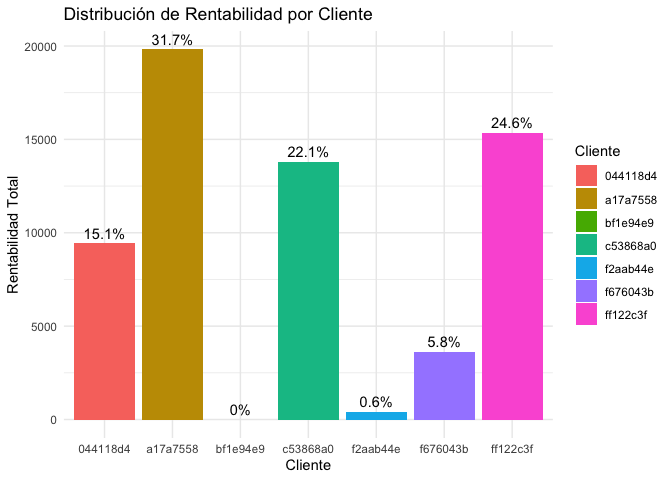
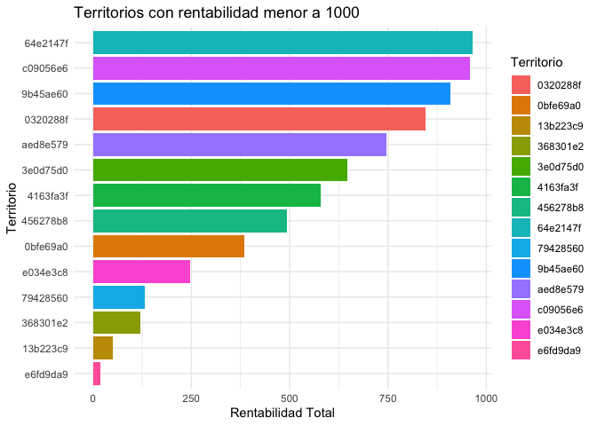

dw-2024-parcial-1
================
Tepi
25/09/2024

# Examen parcial

Indicaciones generales:

- Usted tiene el período de la clase para resolver el examen parcial.

- La entrega del parcial, al igual que las tareas, es por medio de su
  cuenta de github, pegando el link en el portal de MiU.

- Pueden hacer uso del material del curso e internet (stackoverflow,
  etc.). Sin embargo, si encontramos algún indicio de copia, se anulará
  el exámen para los estudiantes involucrados. Por lo tanto, aconsejamos
  no compartir las agregaciones que generen.

## Sección 0: Preguntas de temas vistos en clase (20pts)

- Responda las siguientes preguntas de temas que fueron tocados en
  clase.

1.  ¿Qué es una ufunc y por qué debemos de utilizarlas cuando
    programamos trabajando datos?

**Respuesta:**

Una ufunc en NumPy es una función optimizada que opera elemento a
elemento sobre arrays. Se suelen utilizar porque permiten realizar
operaciones de forma más rápida, eficiente y sin bucles, mejorando así,
el rendimiento al trabajar con grandes conjuntos de datos.

2.  Es una técnica en programación numérica que amplía los objetos que
    son de menor dimensión para que sean compatibles con los de mayor
    dimensión. Describa cuál es la técnica y de un breve ejemplo en R.

**Respuesta:**

La técnica se conoce como “broadcasting” y en programación numérica se
utiliza para realizar operaciones entre objetos (como arrays o matrices)
de diferentes dimensiones al expandir los de menor dimensión para que
sean compatibles con los de mayor dimensión, sin duplicar datos.

Ejemplo en R:

``` r
# Vector con una menor dimensión
vector <- c(1, 2, 3)

# Matriz con mayor dimensión
matriz <- matrix(1:9, nrow = 3, byrow = TRUE)

# Se hace "broadcasting" al sumar el vector a cada fila de la matriz
resultado <- matriz + vector

print(resultado)
```

    ##      [,1] [,2] [,3]
    ## [1,]    2    3    4
    ## [2,]    6    7    8
    ## [3,]   10   11   12

3.  ¿Qué es el axioma de elegibilidad y por qué es útil al momento de
    hacer análisis de datos?

**Respuesta:**

El axioma de elegibilidad establece que en cualquier subconjunto no
vacío siempre debe haber al menos una opción seleccionable como “mejor”
según un criterio. Es útil en análisis de datos dado que, garantiza que
al aplicar filtros o reglas de decisión siempre se podrá identificar al
menos un dato relevante, evitando conjuntos vacíos y asegurando que las
decisiones se basen en opciones válidas.

4.  Cuál es la relación entre la granularidad y la agregación de datos?
    Mencione un breve ejemplo. Luego, exploque cuál es la granularidad o
    agregación requerida para poder generar un reporte como el
    siguiente:

| Pais | Usuarios |
|------|----------|
| US   | 1,934    |
| UK   | 2,133    |
| DE   | 1,234    |
| FR   | 4,332    |
| ROW  | 943      |

**Respuesta:**

La granularidad es el nivel de detalle en los datos, mientras que la
agregación es la forma de resumir esos datos al combinarlos. A mayor
granularidad, más detalle hay, la agregación reduce ese detalle para
simplificar el análisis.

Ejemplo:

Se tiene un listado de todas las compras hechas en una tienda (Sería la
granularidad alta), entonces se puede agregar esos datos sumando las
compras por mes para tener un resumen mensual (Sería la agregación).

Para el reporte presentado arriba, se podría hacer una agregación por
país (datos de usuarios deben estar agrupados por país) y una
granularidad por usuarios (el nivel de granularidad se ha reducido al
conteo de usuarios por país).

## Sección I: Preguntas teóricas. (50pts)

- Existen 10 preguntas directas en este Rmarkdown, de las cuales usted
  deberá responder 5. Las 5 a responder estarán determinadas por un
  muestreo aleatorio basado en su número de carné.

- Ingrese su número de carné en `set.seed()` y corra el chunk de R para
  determinar cuáles preguntas debe responder.

### Mis preguntas a resolver son: 1, 2, 4, 5, 10

``` r
set.seed(20220289) 
v<- 1:10
preguntas <-sort(sample(v, size = 5, replace = FALSE ))

paste0("Mis preguntas a resolver son: ",paste0(preguntas,collapse = ", "))
```

    ## [1] "Mis preguntas a resolver son: 1, 2, 4, 5, 10"

### Listado de preguntas teóricas

1.  Para las siguientes sentencias de `base R`, liste su contraparte de
    `dplyr`:
    - `str()`

    **Su contraparte:**

``` r
## glimpse(df)
```

    * `df[,c("a","b")]` 

**Su contraparte:**

``` r
## df %>% select(a, b)
```

    * `names(df)[4] <- "new_name"` donde la posición 4 corresponde a la variable `old_name` 

\*\*Su contraparte:\*

``` r
## df %>% rename(new_name = old_name)
```

    * `df[df$variable == "valor",]` -> Su contraparte

**Su contraparte:**

``` r
## df %>% filter(variable == "valor")
```

2.  Al momento de filtrar en SQL, ¿cuál keyword cumple las mismas
    funciones que el keyword `OR` para filtrar uno o más elementos una
    misma columna?

**Respuesta:** El Keyword que cumple las mismas funciones que el keyword
“OR” es el keyword “IN” dado que de igual forma puede filtrar uno o más
elementos en una misma columna.

4.  ¿Cuál es la diferencia entre utilizar `==` y `=` en R?

**Respuesta:** El “==” se utiliza para comparar si dos valores son
iguales, mientras que el “=” se usa para asignar un valor a una variable
dentro de funciones o argumentos (Normalmente se suele asignar valores a
una varible con “\<-” pero como se menciona con anterioridad tambien se
puede usar “=”).

5.  ¿Cuál es la forma correcta de cargar un archivo de texto donde el
    delimitador es `:`?

**Respuesta:**

De la siguiente forma es la forma correcta…

``` r
## data <- read.table("archivo.txt", sep = ":", header = TRUE)
```

10. Si quiero obtener como resultado las filas de la tabla A que no se
    encuentran en la tabla B, ¿cómo debería de completar la siguiente
    sentencia de SQL?

    - SELECT \* FROM A \_\_\_\_\_\_\_ B ON A.KEY = B.KEY WHERE
      \_\_\_\_\_\_\_\_\_\_ = \_\_\_\_\_\_\_\_\_\_

    **Respuesta:**

    - SELECT \* FROM A LEFT JOIN B ON A.KEY = B.KEY WHERE B.KEY = IS
      NULL

Extra: ¿Cuántos posibles exámenes de 5 preguntas se pueden realizar
utilizando como banco las diez acá presentadas? (responder con código de
R.)

**Respuesta:**

``` r
# Se crea una función factorial
factorial <- function(x) {
  if (x == 0) return(1)
  result <- 1
  for (i in 1:x) {
    result <- result * i
  }
  return(result)
}

# Número total de preguntas y número de preguntas a seleccionar
n <- 10
k <- 5

# Aplicar la fórmula de combinaciones
combinaciones <- factorial(n) / (factorial(k) * factorial(n - k))
combinaciones
```

    ## [1] 252

``` r
# Otra forma mas sencilla en dado caso, no se desee generar la función manualmente.

possible_exams <- choose(n, k)
print(possible_exams)
```

    ## [1] 252

## Sección II Preguntas prácticas. (30pts)

- Conteste las siguientes preguntas utilizando sus conocimientos de R.
  Adjunte el código que utilizó para llegar a sus conclusiones en un
  chunk del markdown.

A. De los clientes que están en más de un país,¿cuál cree que es el más
rentable y por qué?

B. Estrategia de negocio ha decidido que ya no operará en aquellos
territorios cuyas pérdidas sean “considerables”. Bajo su criterio,
¿cuáles son estos territorios y por qué ya no debemos operar ahí?

### I. Preguntas Prácticas

### No es solo una tabla

## A

Inicializamos, importando los paquetes necesarios que requerimos para
poder realizar el análisis.

``` r
library(dplyr)
library(ggplot2)
parcial_anonimo <- readRDS("parcial_anonimo.rds")
```

Antes de responder a la pregunta, requerimos de saber que clientes se
encuentran operando en más de un país.

``` r
# Agrupar por cliente y pais, luego filtrar clientes que operan en más de un país
clientes_multiples_paises <- parcial_anonimo %>%
  group_by(Cliente) %>%
  summarise(num_paises = n_distinct(Pais)) %>%
  filter(num_paises > 1)

clientes_multiples_paises
```

    ## # A tibble: 7 × 2
    ##   Cliente  num_paises
    ##   <chr>         <int>
    ## 1 044118d4          2
    ## 2 a17a7558          2
    ## 3 bf1e94e9          2
    ## 4 c53868a0          2
    ## 5 f2aab44e          2
    ## 6 f676043b          2
    ## 7 ff122c3f          2

Seguidamente, procedemos a unir la tabla original con los clientes
filtrados mediante un inner_join() a fin de contar con los datos
completos relacionados a los clientes que operan en más de un país.

``` r
# Unir la tabla original con los clientes filtrados
parcial_anonimo_filtrado <- parcial_anonimo %>%
  inner_join(clientes_multiples_paises, by = "Cliente")
```

Calculamos a partir de agrupar los clientes, la rentabilidad total y el
porcentaje que representa sobre el total de las ventas.

``` r
rentabilidad_clientes <- parcial_anonimo_filtrado %>%
  group_by(Cliente) %>%
  summarise(rentabilidad_total = sum(Venta, na.rm = TRUE)) %>%
  arrange(desc(rentabilidad_total)) %>%
  mutate(porcentaje = (rentabilidad_total / sum(rentabilidad_total)) * 100)

rentabilidad_clientes
```

    ## # A tibble: 7 × 3
    ##   Cliente  rentabilidad_total porcentaje
    ##   <chr>                 <dbl>      <dbl>
    ## 1 a17a7558             19818.     31.7  
    ## 2 ff122c3f             15359.     24.6  
    ## 3 c53868a0             13813.     22.1  
    ## 4 044118d4              9436.     15.1  
    ## 5 f676043b              3635.      5.82 
    ## 6 f2aab44e               400.      0.641
    ## 7 bf1e94e9                 0       0

Para entender mejor la data, procedemos a mostrar graficamente mediante
un bar plot sobre el ingreso total que representa cada uno de los
clientes.

``` r
#Barplot usando ggplot2()
ggplot(rentabilidad_clientes, aes(x = Cliente, y = rentabilidad_total, fill = Cliente)) +
  geom_bar(stat = "identity") +
  geom_text(aes(label = paste0(round(porcentaje, 1), "%")), vjust = -0.5) +
  labs(title = "Distribución de Rentabilidad por Cliente", 
       x = "Cliente", 
       y = "Rentabilidad Total") +
  theme_minimal()
```

<!-- -->

A partir de todo lo hecho con anterioridad, se puede concluir que de los
clientes que estan en más de un país, el más rentable es: Cliente
(a17a7558) con una rentabilidad total de 19817.7, lo cual, representa un
31.7% sobre el total de ventas de la compañia.

``` r
cliente_mas_rentable <- rentabilidad_clientes %>%
  top_n(1, rentabilidad_total)

cliente_mas_rentable
```

    ## # A tibble: 1 × 3
    ##   Cliente  rentabilidad_total porcentaje
    ##   <chr>                 <dbl>      <dbl>
    ## 1 a17a7558             19818.       31.7

## B

Inicialmente para nuestro análisis, se puede concluir que no se encontró
ningún territorio que cuente con pérdidasen una perspectiva global
(Cuando nos refirimos a perdidas es que ninguna empresa esta por debajo
del punto de equilibrio, es decir, 0).

``` r
###resuelva acá
Territorios_con_perdida <- parcial_anonimo %>%
  group_by(Territorio) %>%
  summarise(Rentabilidad = sum(Venta, na.rm = TRUE)) %>%
  filter(Rentabilidad <= 0) 

Territorios_con_perdida
```

    ## # A tibble: 0 × 2
    ## # ℹ 2 variables: Territorio <chr>, Rentabilidad <dbl>

Dentro de todos los rentables (Bajo la lógica que estan por encima del
punto de equilibrio), contamos con unos más y otros menos rentables.
Entre ellos, podemos concluir que el territorio menos rentable es el
“e6fd9da9”, ahora bien bajo el criterio de los menos rentables son los
que estan por debajo de 1000 y esos son los que deberiamos de cerrar (Se
pueden observar en la gráfica de barras).

``` r
library(dplyr)
library(ggplot2)

# Agrupar por Territorio y sumar las ventas para cada uno
territorios_rentabilidad <- parcial_anonimo %>%
  group_by(Territorio) %>%
  summarise(total_venta = sum(Venta, na.rm = TRUE)) %>%
  arrange(total_venta)  # Ordenar de menor a mayor rentabilidad

# Filtrar los territorios con una rentabilidad menor a 1000
territorios_con_baja_rentabilidad <- territorios_rentabilidad %>%
  filter(total_venta < 1000)

# Ver los territorios con baja rentabilidad
territorios_con_baja_rentabilidad
```

    ## # A tibble: 14 × 2
    ##    Territorio total_venta
    ##    <chr>            <dbl>
    ##  1 e6fd9da9          18.2
    ##  2 13b223c9          49.9
    ##  3 368301e2         121. 
    ##  4 79428560         132  
    ##  5 e034e3c8         247. 
    ##  6 0bfe69a0         384. 
    ##  7 456278b8         493. 
    ##  8 4163fa3f         580. 
    ##  9 3e0d75d0         647. 
    ## 10 aed8e579         747. 
    ## 11 0320288f         845. 
    ## 12 9b45ae60         908. 
    ## 13 c09056e6         958. 
    ## 14 64e2147f         964.

``` r
# Crear un gráfico de barras para mostrar los territorios con baja rentabilidad
ggplot(territorios_con_baja_rentabilidad, aes(x = reorder(Territorio, total_venta), y = total_venta, fill = Territorio)) +
  geom_bar(stat = "identity") +
  labs(title = "Territorios con rentabilidad menor a 1000",
       x = "Territorio",
       y = "Rentabilidad Total") +
  theme_minimal() +
  coord_flip()  # Para que las etiquetas se vean mejor
```

<!-- -->
